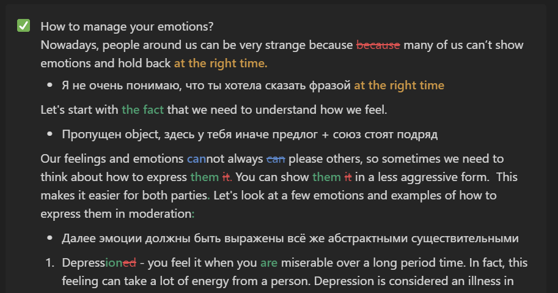

Привет! Меня зовут Артемис, и со мной можно заниматься английским ([напишите мне](https://t.me/artoftheblue)). Я использую графические методы объяснения информации и красивые визуализации, которые делаю самостоятельно, типа этой:

    <video loop autoplay controls width="100%" height="auto">
        <source src="{{ site.baseurl }}/videos/present simple.mp4" type="video/mp4">
    </video>

> Вы можете также посмотреть на [больше анимаций](https://artoftheblue.github.io/tenses/0), почитать [мои посты](https://artoftheblue.github.io) об английских концептах или [сборник с полезной инфой](https://artoftheblue.github.io/english).

## Мои занятия подойдут вам, если

* Вы **разочарованы в школьной системе образования** в России
* Ваш основной поток восприятия информации — **визуальный**
* Вы хотите **научиться писать крутые тексты** не по шаблону или критериям
* Вам **скучно в школе** и вы хотите, чтобы занятия английским соответствовали вашему уровню
* Вы чувствуете, что у вас есть много пробелов в грамматике и вы хотите **структурировать знания**, которые уже у вас есть
* Вы вроде бы всё знаете, но ваши оценки в школе хромают из-за рассеянности, забывчивости или каких-то других "странных" причин

## Мои занятия вам не подойдут, если

* Вы учите английский ТОЛЬКО ради сдачи экзаменов (в частности ЕГЭ)
* Ваша основная цель учить английский — олимпиады
* Вы только начинаете учить английский или находитесь в начальной школе (мои расценки для такого уровня имхо слишком дорогие, и у меня нет психологического или педагогического образования)

## Немножко о квалифицированности

* Уровень английского — **С2**
* **100 баллов** на **ЕГЭ** по английскому в 2021-м году
* Призёр заключительного этапа **ВсОШ** в 2021-м году
* Команда Московской области по английскому языку 2020–2021
* Дипломант множества [перечневых олимпиад](https://olimpiada.ru/article/1043) по английскому языку в 2020–2021 году (Высшая проба, Ломоносов, Евразийская, др.)
* **9 месяцев** работы переводчиком-редактором в НКО
* **3 года** репетиторства

## Прайс-лист & методика

> Цены зависят от моей загруженности (чем меньше у меня учеников сейчас, тем за более маленькую сумму я готов брать новых).

| | Индивидуальное занятие | Регулярные занятия |
|:-:|:-:|:-:|
| 40 минут | 1200 руб | 8000 руб/месяц |
| 60 минут | 1500 руб | 10000 руб/месяц |
| 90 минут | 1800 руб | 12000 руб/месяц |

> Занятия со мной включают в себя мега-качественные разборы письменных работ и возможность задавать мне любые вопросы практически 24/7. **Пример разбора:** 

### Методика будет максимально эффективна при

* Регулярности занятий (2 раза в неделю)
* Выполнении домашки (по 1–2 письменных работы в неделю в начале + другие задания)

### Разница между индивидуальными и регулярными занятиями

#### Индивидуальные

* Индивидуальные занятия согласовываются и оплачиваются **крайний срок в 23:59 в предыдущий день** до самого занятия. За ними не фиксируется единый временной слот, и можно выбирать любое время и любую частоту занятий.
* Если занятие нужно отменить/перенести, это можно спокойно сделать в любой момент до самого дня занятия.
* Занятие можно отменить в день его проведения, но тогда деньги, заплаченные за занятие, **не возвращаются.**
* Занятие можно отменить в день его проведения с возвратом/переносом оплаты на другой день в случае болезни или другой уважительной причины.